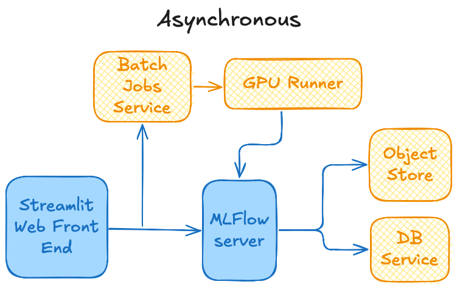
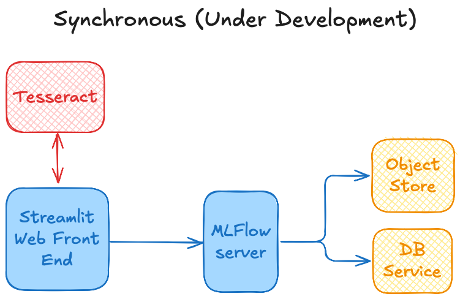

# TSADAR GUI
This is a streamlit app for TSADAR, an open-source Thomson Scattering data analysis package. 

To run this app, install the requirements and then run

`python tsadar_app.py`

and you should be able to view the app in a browser

### Cloud Architecture
This app can be, and is deployed to the public cloud. This enables the user to run Thomson Scattering analysis remotely, and either asynchronously and synchronously (under development)

The Asynchronous architecture submits a job to AWS Batch for the entire analysis and returns the result

The Synchronous architecture uses a TSADAR [Tesseract](https://github.com/pasteurlabs/tesseract-core) for the spectrum and gradient calculation and enables the user to interact with the data and the fit
