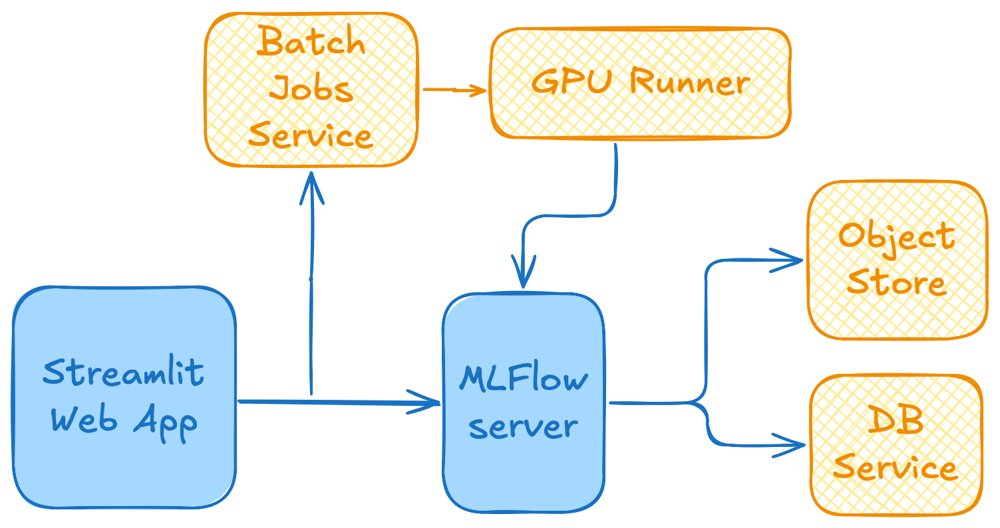

# TSADAR GUI
This is a streamlit app for TSADAR, an open-source Thomson Scattering data analysis package. 

To run this app, install the requirements and then run

`python tsadar_app.py`

and you should be able to view the app in a browser

### Cloud Architecture
